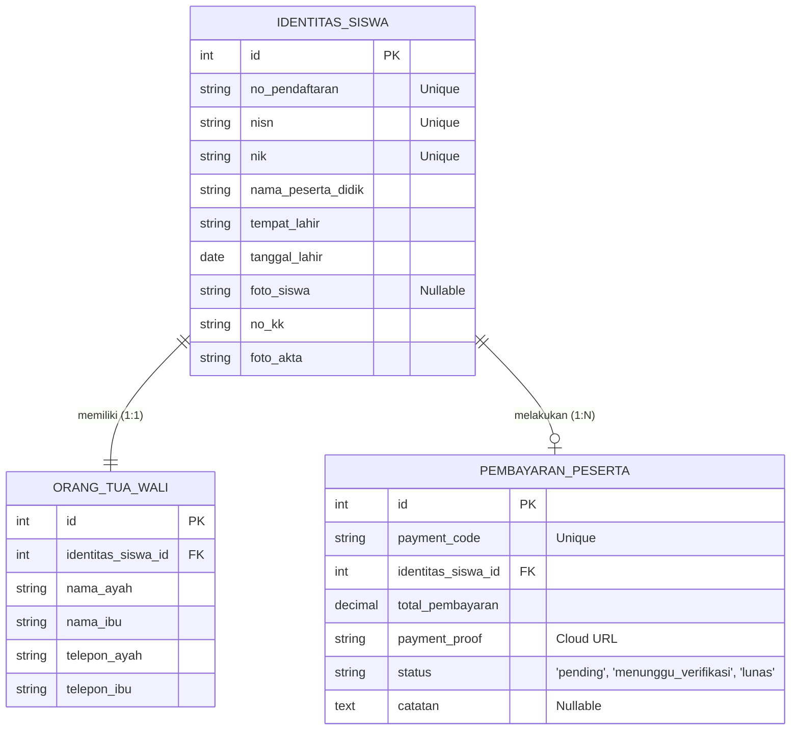

# LAPORAN TEKNIS SISTEM
## Pengembangan Sistem Informasi Penerimaan Peserta Didik Baru (PPDB) Online Berbasis Web pada Sekolah Amanah Bangsa Cikarang

---

### ABSTRAK
Sistem Informasi Penerimaan Peserta Didik Baru (PPDB) Online merupakan solusi teknologi yang dirancang untuk memfasilitasi proses pendaftaran calon siswa baru secara efisien, transparan, dan terintegrasi. Sistem ini dibangun menggunakan arsitektur Model-View-Controller (MVC) melalui framework PHP Laravel. Guna mendukung deployment pada lingkungan serverless (seperti Vercel) yang memiliki keterbatasan penyimpanan lokal (*ephemeral filesystem*), sistem diintegrasikan dengan Cloudinary Storage API. Keamanan data transaksi pembayaran dijamin dengan implementasi metode pembayaran QRIS Statis yang dikombinasikan dengan teknik kompresi gambar (Intervention Image v3) menjadi format WebP untuk menghemat konsumsi bandwidth dan media penyimpanan. Pengujian fungsional menunjukkan seluruh subsistem (pendaftaran, otentikasi, pembayaran, verifikasi admin, dan pencetakan kartu) dapat berjalan secara sinkron dengan performa visual yang dioptimalkan sesuai dengan identitas Sekolah Amanah Bangsa Cikarang.

---

### I. PENDAHULUAN
Penerimaan Peserta Didik Baru (PPDB) secara konvensional seringkali menghadapi kendala administratif seperti antrean fisik, risiko kehilangan berkas fisik, dan lambatnya verifikasi pembayaran biaya administrasi. Untuk mengatasi masalah tersebut, dikembangkan sebuah aplikasi PPDB Online berbasis web untuk Sekolah Amanah Bangsa Cikarang. Laporan teknis ini menguraikan arsitektur sistem, tumpukan teknologi (*technology stack*), skema basis data, mekanisme penanganan media, serta alur fungsional sistem secara komprehensif untuk dokumentasi akademis maupun teknis.

---

### II. TUMPUKAN TEKNOLOGI (*TECHNOLOGY STACK*)

Sistem dirancang menggunakan pendekatan modular yang memisahkan logika backend, penyajian antarmuka (frontend), dan penyimpanan data.

#### A. Backend & Framework Utama
- **Bahasa Pemrograman**: PHP (versi 8.x).
- **Framework**: **Laravel (versi 11.x)**. Pemilihan framework ini didasari oleh ketersediaan fitur bawaan seperti:
  - *Eloquent ORM*: Mempermudah interaksi relasional objek dengan basis data menggunakan sintaks deklaratif.
  - *Blade Templating Engine*: Mengurangi redundansi layout dengan sistem pewarisan komponen halaman yang efisien.
  - *Middleware*: Digunakan sebagai pintu gerbang otentikasi untuk membedakan hak akses tingkat Admin dan tingkat Peserta secara terenkripsi.

#### B. Antarmuka Pengguna (Frontend)
- **Struktur & Tata Letak**: HTML5 dan **Bootstrap 5**.
- **Bahasa Desain (Styling)**: Vanilla CSS dengan pemanfaatan *CSS Custom Properties (Variables)*. Tema warna disesuaikan dengan identitas Sekolah Amanah Bangsa Cikarang menggunakan palet warna:
  - `--primary`: `#1e7c3e` (Hijau Utama)
  - `--primary-dark`: `#166534` (Hijau Gelap / Hover)
  - `--primary-light`: `#f0fdf4` (Hijau Muda untuk indikator/aktif)
  - `--accent`: `#dc2626` (Aksen Merah untuk peringatan / border)
- **Logika Interaktif**: JavaScript Vanilla untuk validasi form di sisi klien, manajemen dinamis pilihan tagihan, dan pemrosesan AJAX.

#### C. Basis Data (Database)
- **Engine**: MySQL (pada server produksi) atau SQLite (pada lingkungan pengujian lokal).
- **Strategi Migrasi**: Menggunakan Laravel Migrations untuk menjaga konsistensi skema basis data antar lingkungan pengembangan.

---

### III. ARSITEKTUR STRATEGI PENYIMPANAN & PENGOLAHAN GAMBAR

#### A. Masalah Keterbatasan Lingkungan Serverless
Ketika dideploy ke server berbasis serverless (contoh: Vercel atau AWS Lambda), sistem penyimpanan berkas lokal bersifat *read-only* atau *ephemeral* (berkas yang diunggah akan terhapus otomatis saat kontainer melakukan restart). Menyimpan berkas bukti transfer di dalam folder `/storage` lokal akan mengakibatkan data hilang secara permanen.

#### B. Solusi Penyimpanan Awan (Cloud Storage)
Sistem diintegrasikan dengan **Cloudinary API** melalui library resmi SDK PHP (`cloudinary/cloudinary_php`). Basis data lokal hanya menyimpan alamat tautan HTTPS unik (*secure_url*) yang menunjuk ke server Cloudinary, sehingga menjamin keberlanjutan data.

#### C. Prapemrosesan & Kompresi Gambar
Untuk menghemat ruang penyimpanan awan dan mempercepat waktu tunggu panitia saat memverifikasi bukti bayar, diimplementasikan library **Intervention Image v3** dengan alur prapemrosesan sebagai berikut:
1. **Intersepsi File**: File mentah berformat `.jpg`, `.jpeg`, atau `.png` ditangkap dari form request.
2. **Dekode & Driver**: File didekode menggunakan ekstensi **PHP GD** (atau Imagick).
3. **Konversi Format**: Format gambar secara dinamis dikonversi ke format **WebP**.
4. **Kompresi**: Kualitas gambar dikompresi ke tingkat **75%**, yang menurunkan ukuran file rata-rata di bawah 150 KB tanpa mengorbankan keterbacaan data teks pada bukti transfer.
5. **Standarisasi Penamaan**: File dinamai dengan format:
   `bukti_qris_PPDB_[NoPendaftaran_Cleaned]_[Timestamp]`
6. **Unggah & Pembersihan**: Gambar dikirim ke Cloudinary dalam folder khusus `ppdb_qris_pembayaran`. Setelah transfer sukses, file temporer pada server lokal segera dihapus untuk menjaga kebersihan sistem.

---

### IV. STRUKTUR DAN SKEMA BASIS DATA

Relasi basis data dibangun atas tiga entitas utama yang saling terhubung untuk melacak pendaftaran dan pembayaran secara historis.

---

### V. ALUR FUNGSIONAL SISTEM (*WORKFLOW*)

#### 1. Tahap Pendaftaran Siswa & Orang Tua (Sisi Publik)
- Calon siswa mengisi formulir identitas diri, mengunggah dokumen KK dan Akta kelahiran.
- Setelah data siswa tersimpan, sistem merujuk ke formulir data Orang Tua/Wali dengan membawa ID relasi (`identitas_siswa_id`).
- Setelah kedua formulir lengkap, sistem menerbitkan kode unik pendaftaran (contoh: `PPDB-2026-0004`).

#### 2. Tahap Otentikasi Portal Peserta (Login)
- Peserta masuk ke portal dashboard menggunakan kombinasi **NISN** dan **Tanggal Lahir** (sebagai kredensial keamanan).

#### 3. Tahap Transaksi Pembayaran QRIS Statis
- Peserta memilih jenis tagihan biaya administrasi (Seragam, LKS, MOS, dll).
- Sistem menampilkan total nominal akumulasi tagihan dan menampilkan gambar kode **QRIS Statis** resmi Sekolah Amanah Bangsa Cikarang.
- Peserta memindai QRIS, mentransfer uang sesuai nominal, dan mengunggah gambar bukti transfer.
- Status pembayaran diperbarui menjadi `menunggu_verifikasi`.

#### 4. Tahap Verifikasi Transaksi (Sisi Admin)
- Admin sekolah login ke panel khusus admin.
- Menu verifikasi menampilkan daftar pembayaran berstatus `menunggu_verifikasi`.
- Admin dapat melihat pratinjau bukti transfer langsung dari server awan Cloudinary.
- Admin mengklik tombol **Konfirmasi** (mengubah status menjadi `Lunas` dan menerbitkan status verifikasi berkas lengkap) atau **Tolak** (mengembalikan berkas dengan catatan revisi).

#### 5. Cetak Dokumen Kelulusan
- Peserta yang administrasinya telah diverifikasi (`Lunas`) dapat mengunduh dan mencetak Kartu Pendaftaran PPDB resmi.
- Tata letak cetak kartu diatur menggunakan aturan CSS Media Query `@media print` dan dioptimalkan agar logo horizontal Sekolah Amanah Bangsa Cikarang berukuran proporsional (lebar tetap `180px` dan tinggi `50px` dengan `object-fit: contain`) tanpa menutupi teks dokumen.

---

### VI. KESIMPULAN
Sistem informasi PPDB Online Sekolah Amanah Bangsa Cikarang ini berhasil mengatasi keterbatasan infrastruktur serverless lokal dengan menerapkan penyimpanan awan yang terkompresi. Penerapan teknologi Laravel 11.x dikombinasikan dengan frontend Bootstrap 5 serta pemrosesan gambar dinamis format WebP menghasilkan sistem yang responsif, andal secara fungsional, dan ramah terhadap penggunaan resource server.
